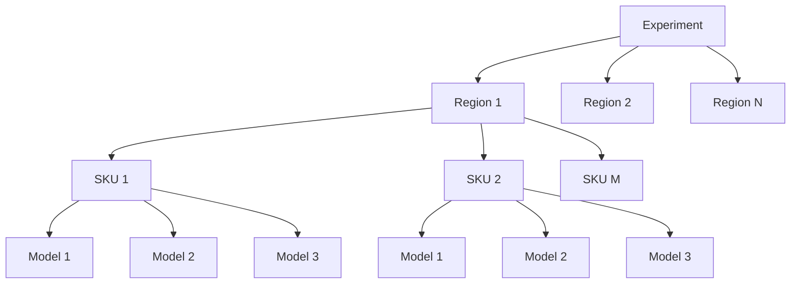
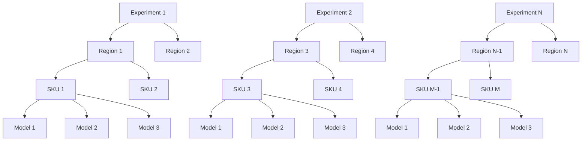

# Product Requirements Document

## Description
I need to design a solution that effeciently logs mlflow runs in a structure of parent and child 
runs. The main benchmark is to be able to log 500k in 10 minutes at best, and at worst 20 
minutes. The model training to simulate is a multinode cpu training job that trains 500k models 
in parallel in a pandas udf in a spark cluster. Each pandas udf worker node, returns back a 
dataframe with the model details (model name, model as binary string, etc etc).

There are three main approaches of how you can do this. 

## Approach 1: One experiment - One artifact table - One model

After multinode training is complete. Return all models to a single dataframe on the driver 
node. Log a table that holds all 500k models with metadata (model_name, model_as_binary_string, 
etc etc). 

## Approach 2: Log 500k to 1 experiment with nested runs of target heirarchy
After multinode training is complete. Return all models details to a single dataframe on the
driver. Subsequently iterate through the dataframe to log the desired heirarchy of models. For
example, training a demand forecast at the region + sku level, you can log a parent run for each
region, and then log child runs for each sku under the parent region run, and then another level of child runs for each model trained for the sku.

## Approach 3: Distribute logging across n experiments with nested runs of target heirarchy

Each Region is mapped to an experiment. Where the experiment name should be the region name with 
prefix with `Demand_Forecasting-[REGION]`.

# Best Practices for Fast MLFlow Logging at Scale

- Refer to [MLFlow Logging Best Practice](../docs/MLflow%20Logging%20at%20Scale%20%E2%80%94%20Best%20Practices%20(Albertsons).pdf)
